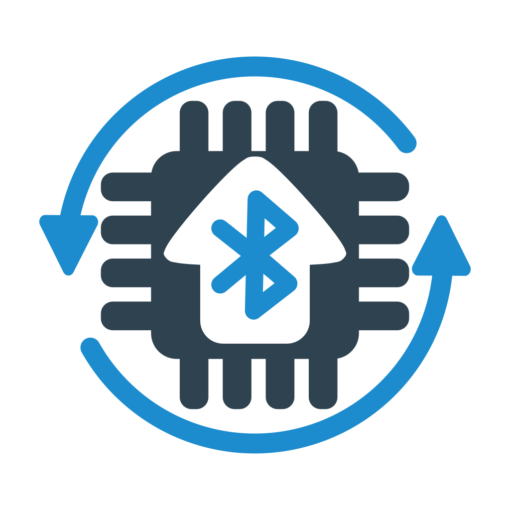

# BleOta
Graphical application for upload firmware over Bluetooth.\
\
Fully works on `Android` and `iOS`. For other OS it depends on `flutter_reactive_ble` library.\
Local files upload is disabled by default to prevent unknown firmware upload by end users, enable it by changing `Always allow local files upload` in `Settings`.\
Additionally update functionality for specific hardwares is supported.
If you want end users have ability to update your hardware check `doc/ADD_NEW_HARDWARE.md`.

&nbsp;&nbsp;&nbsp;
&nbsp;&nbsp;&nbsp;

> **REMARK**: Application not released on `App Store` yet.
> Apple corporation require `100$/year` developer fees even for free and open source applications.
> If you want to support project, fill free to send me small amout or help with idea how to release app in `iOS` without developer fees.

## Peripheral device side
Arduino library: https://github.com/vovagorodok/ArduinoBleOTA
