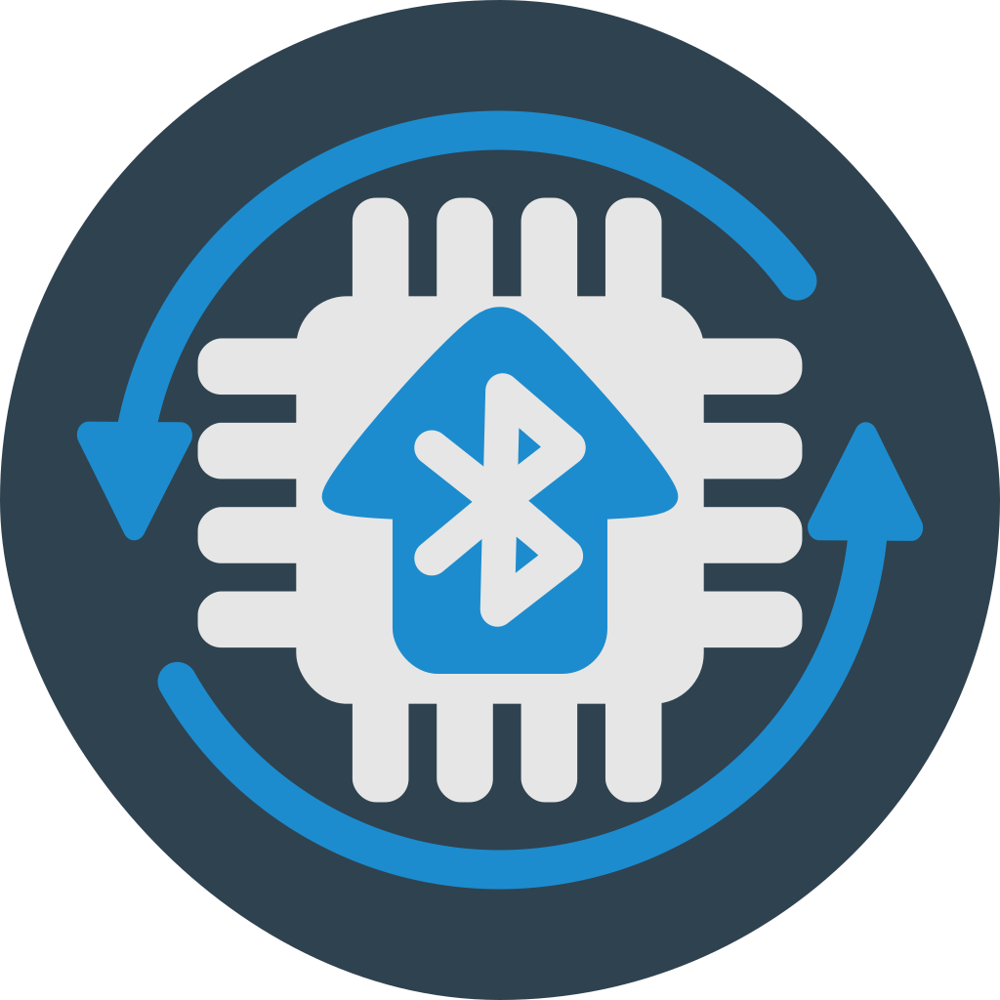

# Ble Ota App
\
Graphical application for upload firmware over Bluetooth.\
Fully works on Android and iOS. For other OS it depends on flutter_reactive_ble library.\
Additionally supports update functionality for specific hardwares. More about it in `doc/ADD_NEW_HARDWARE.md`.

<table>
  <tr>
    <td>
      
    </td>
    <td>
      
    </td>
    <td>
      
    </td> 
  </tr>
</table>

## Peripheral device side
https://github.com/vovagorodok/ArduinoBleOTA

## Build and release
https://docs.flutter.dev/deployment/android